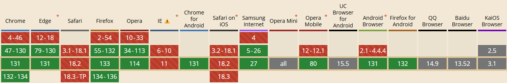

# requestIdleCallback

## 概述

允许开发者在浏览器空闲时执行后台和低优先级任务，而不会影响关键事件（如动画和输入响应）的延迟。

这个 API 提供了一种高效的方式来利用浏览器的空闲时间执行非紧急任务。

## 语法

```ts
window.requestIdleCallback(callback, options)
```

### 参数

- `callback`：一个在事件循环空闲时即将被调用的函数的引用。函数会接收到一个名为 IdleDeadline 的参数，这个参数可以获取当前空闲时间以及回调是否在超时时间前已经执行的状态
- `options`：可选，一个配置对象，包含以下属性：
  - `timeout`：如果指定了 timeout，并且有一个正值，而回调在 timeout 毫秒过后还没有被调用，那么回调任务将放入事件循环中排队，即使这样做有可能对性能产生负面影响

### 返回值

一个 ID，可以把它传入 `Window.cancelIdleCallback()` 方法来结束回调

## 兼容性



难搞，等兼容性好了再用吧

## 参考

- [掘金](https://juejin.cn/post/7061947637167194142)
- [developer.mozilla](https://developer.mozilla.org/zh-CN/docs/Web/API/Background_Tasks_API)
