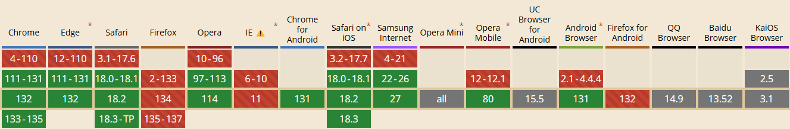

# startViewTransition

是一种用于在不同视图 `same-document transitions (SPAs)` 之间进行平滑过渡的技术。它可以增强用户体验，使页面切换更加流畅和自然

## 兼容性



## 语法

```ts
document.startViewTransition(callback)
```

## 参数

1. callback

    一个在视图过渡过程中通常用于更新 DOM 的回调函数，它返回一个 Promise
    这个回调函数在 API 截取了当前页面的屏幕截图后被调用。
    当回调函数返回的 Promise 兑现时，视图过渡将在下一帧开始。如果回调函数返回的 Promise 拒绝，过渡将被放弃。

## 返回值

ViewTransition 对象实例

### 实例属性

- `finished`: 在过渡动画完成后兑现的 Promise，新的页面视图对用户可见且可交互
- `ready`: 一个在伪元素树创建且过渡动画即将开始时兑现的 Promise
- `updateCallbackDone`: 当 `document.startViewTransition()` 的回调返回的 Promise 兑现时，该 Promise 也会兑现

### 实例方法

- `skipTransition()`: 跳过视图过渡的动画部分，但不会跳过运行 `document.startViewTransition()` 的回调，该回调会更新 DOM。

## 视图过渡过程

1. 当调用 `document.startViewTransition()` 时，API 会截取当前元素(have a view-transition-name declared on them)截图。
2. 调用传递给 `startViewTransition()` 的回调函数(更改dom操作，返回一个 Promise)
3. 当回调函数返回的 Promise resolve时，`ViewTransition.updateCallbackDone` Promise 也会 resolve，视图过渡将在下一帧开始。此时可以获取更新后的 DOM
4. API 会捕获页面的新状态并实时展示
5. API 构造了一个具有以下结构的伪元素树:
    - ::view-transition
        - ::view-transition-group(root)
            - ::view-transition-image-pair(root)
                - ::view-transition-old(root)
                - ::view-transition-new(root)
6. 当过渡动画即将运行时, `ViewTransition.ready` Promise resolve, 你可以响应它进行一些操作，例如运行自定义的 JavaScript 动画，而不是默认的动画。
7. 旧页面视图的 `opacity` 从 1 过渡到 0，而新视图从 0 过渡到 1，这就是默认的交叉淡入淡出效果。
8. 当过渡动画结束时，`ViewTransition.finished` Promise resolve

### 关于第二步的更改DOM操作

实验了以下几种方式

```ts
document.startViewTransition(() => {
  const aaa = document.querySelector('#aaa')!
  // 1. 直接删除, ok
  aaa.remove()
  // 2. resolve, ok
  Promise.resolve().then(() => {
    aaa.remove()
  })
  // 3. setTimeout, 不行
  setTimeout(() => {
    aaa.remove()
  })
  // 4.把这个写道最后都不影响上面3种情况, TODO 是不是可以这么理解：一个微任务队列里面的操作dom动作，都可以被捕捉到
  return Promise.resolve()
  // 5. 返回一个Promise, ok
  return new Promise<void>((resolve) => {
    setTimeout(() => {
      aaa.remove()
      resolve()
    }, 2000)
  })
})
```

### 伪元素树

- `::view-transition`: 是视图过渡叠加层的根元素，它包含所有视图过渡且位于所有其他页面内容的顶部。
- `::view-transition-old`: 是旧页面视图的屏幕截图
- `::view-transition-new`: 是新页面视图的屏幕截图

<Demo src="./Demo.vue"></Demo>

## 参考

- [zhangxinxu](https://www.zhangxinxu.com/wordpress/2024/08/view-transitions-api/)
- [developer.mozilla.org](https://developer.mozilla.org/zh-CN/docs/Web/API/View_Transition_API)
