# alova

## 请求类型

| 方法 | 参数 |
| --- | --- |
| Get | `alovaInstance.Get(url[, config])` |
| Post | `alovaInstance.Post(url[, data[, config]])` |
| Put | `alovaInstance.Put(url[, data[, config]])` |
| Delete | `alovaInstance.Delete(url[, data[, config]])` |
| Patch | `alovaInstance.Patch(url[, data[, config]])` |
| Head | `alovaInstance.Head(url[, config])` |
| Options | `alovaInstance.Options(url[, config])` |

## 响应流程

::: warning
从上图可知， 在 hook 的 `onSuccess` 中抛出错误将会触发 hook 的 `onError`
:::

## 请求策略

### `useRequest`

- `immediate` 默认 `true`

### `useWatcher`

- `immediate` 默认 `false`
- `debounce` 防抖时间，单位毫秒，默认 `0`
- `abortLast` 是否在触发时中止上一次请求，防止请求时序混乱，默认 `true`

### `useForm` 表单提交策略

### `useAutoRequest` 自动请求策略

### `accessAction` 和 `actionDelegationMiddleware` 跨组件触发请求
