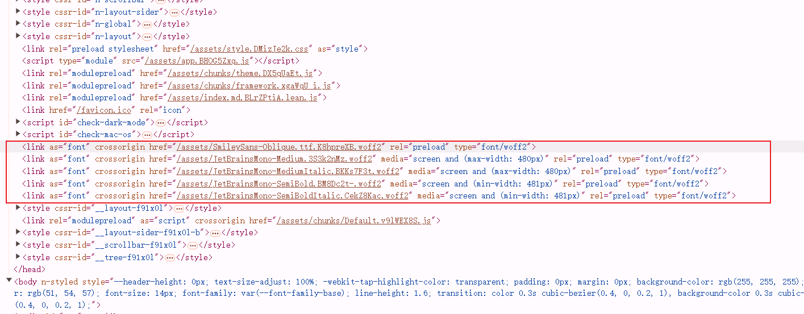

# preload字体

## 假设使用了以下字体

```css
@font-face {
  font-family: JetBrainsMonoMedium;
  font-style: normal;
  src: url('../fonts/JetBrainsMono-Medium.woff2') format('woff2');
  font-display: swap;
}

@font-face {
  font-family: JetBrainsMonoMedium;
  font-style: italic;
  src: url('../fonts/JetBrainsMono-MediumItalic.woff2') format('woff2');
  font-display: swap;
}

@font-face {
  font-family: JetBrainsMonoSemiBold;
  font-style: normal;
  src: url('../fonts/JetBrainsMono-SemiBold.woff2') format('woff2');
  font-display: swap;
}

@font-face {
  font-family: JetBrainsMonoSemiBold;
  font-style: italic;
  src: url('../fonts/JetBrainsMono-SemiBoldItalic.woff2') format('woff2');
  font-display: swap;
}

@font-face {
  font-family: SmileySans-Oblique;
  font-style: normal;
  src: url('../fonts/SmileySans-Oblique.ttf.woff2') format('woff2');
  font-display: swap;
}
```

## 根据屏幕大小使用不同的字体

```css
:root {
  --font-family-others: 'JetBrainsMonoMedium';
  --font-family-semi-bold-others: 'JetBrainsMonoSemiBold';
  --font-family-zh: 'SmileySans-Oblique';

  /* tailwindcss 使用的两种字体 */
  --default-mono-font-family: var(--font-family-semi-bold-others), var(--font-family-zh);
  --default-font-family: var(--default-mono-font-family);

  @media screen and (width <= 480px) {
    /* 小屏幕使用不那么粗的字体 */
    --default-mono-font-family: var(--font-family-others), var(--font-family-zh);
  }
}
```

## 头部预加载字体

```ts
const obj = {
  // 其他 vitepress 配置
  transformHead({ assets }) {
    const smileySansFontFileArr = assets.filter((str: string) =>
      /SmileySans[\w\-.]+\.woff2/.test(str),
    )
    const interLinks: [string, Record<string, string>][] = smileySansFontFileArr.map(
      (href: string) => {
        return [
          'link',
          {
            as: 'font',
            crossorigin: '',
            href,
            rel: 'preload',
            type: 'font/woff2',
          },
        ]
      },
    )
    const JetBrainsMonoFontFileArr = assets.filter((str) =>
      /JetBrainsMono[\w\-.]+\.woff2/.test(str),
    )
    const obj = {
      Medium: 'screen and (max-width: 480px)',
      SemiBold: 'screen and (min-width: 481px)',
    }
    const JetBrainsMonoLinks: [string, Record<string, string>][] = JetBrainsMonoFontFileArr.map(
      (href) => {
        // 这里[\w-]  和 [\w\-] 相同中间的 - 会被转义
        const result = href.match(/JetBrainsMono-(\w+)\.[\w-]+\.woff2/)![1]
        const key = result.endsWith('Italic') ? result.slice(0, -6) : result
        return [
          'link',
          {
            as: 'font',
            crossorigin: '',
            href,
            media: obj[key as keyof typeof obj],
            rel: 'preload',
            type: 'font/woff2',
          },
        ]
      },
    )
    return [...interLinks, ...JetBrainsMonoLinks]
  }
}
```

## 结果


