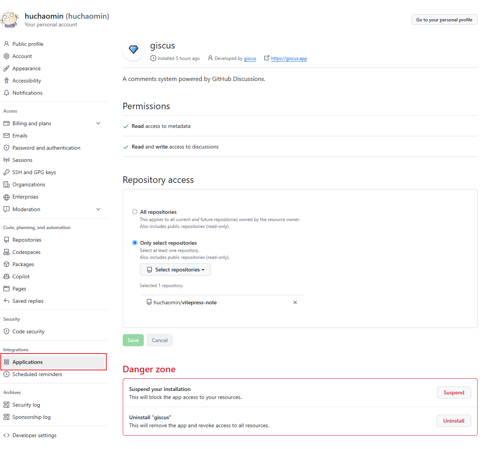
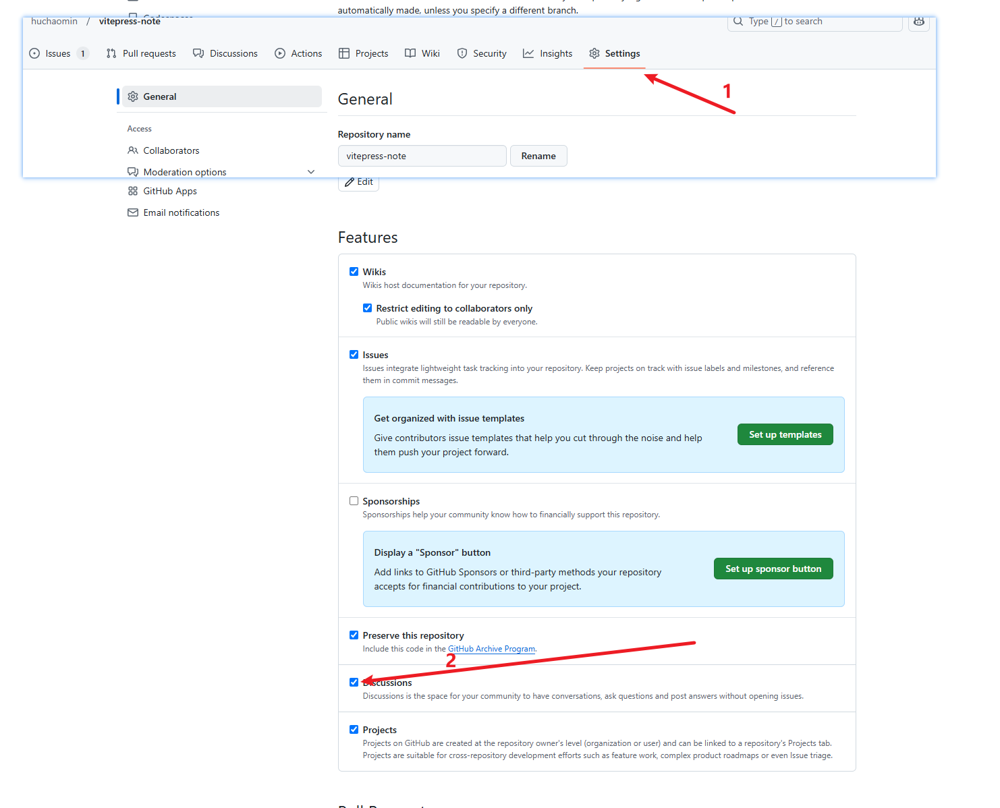

# 添加giscus评论

## 配置 giscus

1. 仓库是公开的，否则访客将无法查看 discussion
2. [giscus](https://github.com/apps/giscus) app 已安装，否则访客将无法评论和回应,安装后的结果如下
  
3. 仓库的 discussions 功能已启用，否则访客将无法评论和回应
  
4. 打开[giscus 官网](https://giscus.app/zh-CN)
5. 填写仓库：`owner/repo`，例如：`huchaomin/vitepress`
6. 页面 与 discussion 映射关系，勾选 pathname
7. discussion 分类 按照推荐选择 announcements
8. 只搜索该分类中的 discussion 建议勾选
9. 特性建议全部勾上

然后你就在 ‘启用 giscus‘ 下面看到你的配置了

## 安装 vue 组件

```bash
pnpm add @giscus/vue
```

## 创建 giscus 组件, 并把上述配置传到vue组件中，并在页面中使用

<<< @/../../.vitepress/theme/components/Comment.vue

## 本博客配置

如上，我这里使用的与上述步骤生成的有亮点不同：

- strict:'1'
- mapping:'og:title'

因为我把我的页面的 uuid 作为 og:title 传给了 giscus，这样就可以在 giscus 中通过 og:title 来查找对应的 discussion

```ts
// .vitepress/config.ts
const obj = {
  // ...
  transformHead({ pageData }) {
    const uuid = pageData.frontmatter.uuid as string | undefined
    if (uuid) {
      return [
        [
          'meta',
          {
            content: uuid,
            property: 'og:title',
          },
        ],
      ]
    }
  },
}
```

推荐大家也这样做，第六步其他选项 pathname、URL、title 大部分情况下没有问题<br>
但如果你想给你的博客页面移动一下位置，导致你的url变了，那么你的评论就找不到了。 <br>
上一篇：[添加gitalk评论](../添加gitalk评论/index.md) 也有这个问题，至于怎么生成 uuid, 可以看这个博客的源码，写的不好可以使用这个评论喷我

## 题外话

这个博客如果想在开发环境也能看到评论的话，操作如下

1. 在 .vitepress/config.ts 中 从 transformHead(prod) 移到 transformPageData(dev 和 prod)

    ```ts
    // .vitepress/config.ts
    const obj = {
      // ...
      transformPageData(pageData) {
        const uuid = pageData.frontmatter.uuid as string | undefined
        if (uuid) {
          pageData.frontmatter.head ??= []
          ;(pageData.frontmatter.head as any[]).push([
            'meta',
            {
              content: uuid,
              property: 'og:title',
            },
          ])
        }
      },
    }
    ```

2. 去掉 Comment.vue 中的 `isProd` 判断
