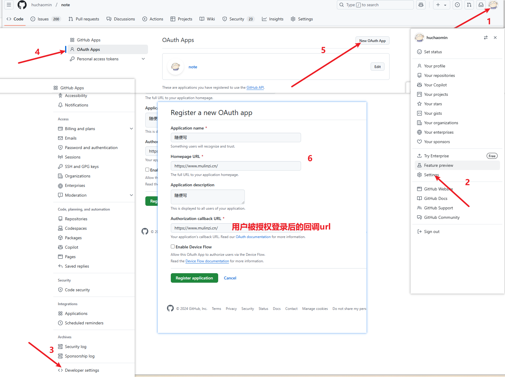
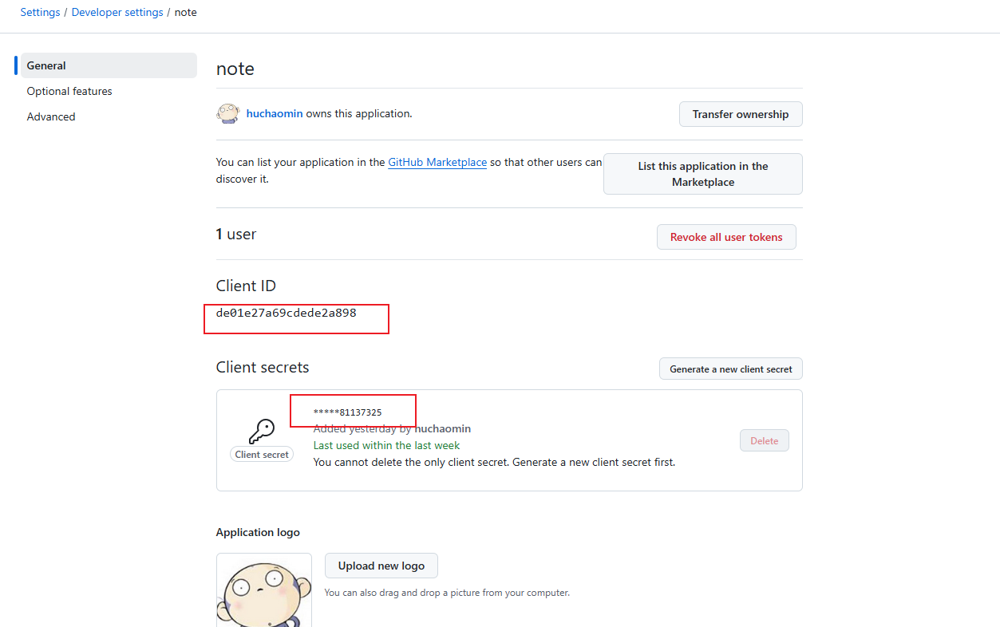
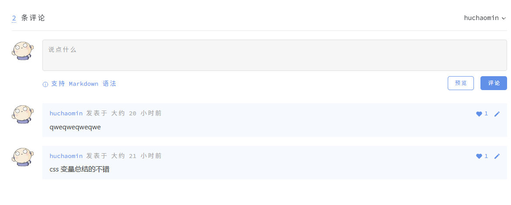

# 添加gitalk评论

## 创建 GitHub Application



填写完后点击 Register application，就会进到下面这个页面，点击 Generate a new client secret 创建一个新的 secret，创建完后记得先复制一下，后面再刷新页面就看不到 secret 了



## 引入 gitalk

```bash
pnpm add gitalk
```

## 创建 gitalk 组件, 并在页面中使用

```vue
<script lang="ts" setup>
import Gitalk from 'gitalk'
import { inBrowser, useData } from 'vitepress'
import 'gitalk/dist/gitalk.css'

const { frontmatter } = useData()

const gitalkContainer = ref<HTMLElement | null>(null)

watchEffect(() => {
  if (inBrowser) {
    // 依赖要写在这里才能，被 watchEffect（同步） 监听到
    const id = frontmatter.value.uuid
    nextTick(() => {
      gitalkContainer.value!.innerHTML = ''
      if (!id) {
        return
      }
      const gitTalk = new Gitalk({
        admin: ['huchaomin'],
        clientID: 'de01e27a69cdede2a898',
        clientSecret: '**你的完整clientSecret**81137325',
        createIssueManually: true, // 如果当前页面没有相应的 issue 且登录的用户属于 admin，则会自动创建 issue。如果设置为 true，则显示一个初始化页面，创建 issue 需要点击 init 按钮。
        id, // 可选。默认为 location.href
        labels: ['GitTalk'], // GitHub issue 标签
        owner: 'huchaomin', // GitHub repository 所有者
        repo: 'vitepress-note',
      })
      gitTalk.render(gitalkContainer.value!)
    })
  }
})
</script>

<template>
  <div ref="gitalkContainer"></div>
</template>
```

::: warning
`frontmatter.value.uuid` 是当前页面对应 md 文件的 uuid，这个是我自己工程里面创建的。<br>
这样的好处是: 当你的文件夹结构发生变化或者文件名发生变化导致 url 发生变化。<br>
使用 `location.pathname` 或者 `location.href` 作为 id 会导致评论数据丢失，而使用 uuid 作为 id 则不会有这个问题。
:::

## 结果



## 参考

- [Gitalk 运作原理](https://carl-zk.github.io/blog/2020/03/03/gitalk-%E8%BF%90%E4%BD%9C%E5%8E%9F%E7%90%86/)
- [richard 的博客](https://richard-docs.netlify.app/blogs/b-027)
