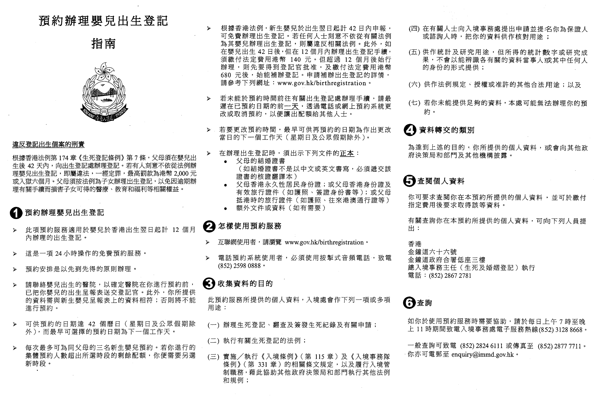

# 宝宝出生需要办的证件以及说明

## 准备

### 宝宝名称

- 男宝宝：中文 ---> 一然，英文 ---> Yiran
- 女宝宝：中文 ---> 一可，英文 ---> Echo

### 入境小白条

## 香港

1. 出世纸：相当于内地出生证明 当天可领（必要）
    - 地址：新界沙田上禾輋路1號沙田政府合署3樓(港沙田站B出口)
    - 有没有必要拿出生证明书或出生登記記項的核證副本（140港币）
    - 提前填好出生登记所需资料[表格BDR93A](https://www.immd.gov.hk/pdforms/bdr93a.pdf)
2. 回港证：回香港必要证件 当天可领（必要）
    - 现场取证，出世纸隔壁柜台，办出世纸办回港证无需预约
    - 副署人到场+签名+证件
    - 申請香港特別行政區回港證申請說明書(適用於十六歲以下兒童)[表格ID(C)73A](https://www.immd.gov.hk/pdforms/ID(C)73A.pdf)
    - 近照一张：不戴帽子的正面近照、背景應為淺色，並無任何裝飾、相片尺寸不得超過55 X 45毫米或小於50 X 40毫米
    - 副署人到场+签名+证件: [副署事項表格(ID641)](https://www.immd.gov.hk/pdforms/ID641n.pdf)及副署人的身份證明文件副本
    - 170 港币
3. 回乡证：回内地必要证件 最快次日可领（必要）
    - 地址：[新界沙田石門安群街1號京瑞廣場2期26樓J室](https://www.ctshk.com/mep/zh/ch-entry-permit-service-centres-2/)
    - 填写[香港中旅证件服务中心](https://www.ctshk.com/pass/booking1.jsp)表格
    - 取辦證籌號
    - 能不能用回执单，办一个临时的一次性的回乡证（加急）
    - [参考攻略](https://www.aig.com.hk/zh/campaign-pages/travel/application-for-mainland-travel-permit)
4. 永居身份证：两周可领
    - 办理回港证的隔壁窗口办理
5. 护照：两周可领
    - 办理回港证的隔壁窗口办理

### 注意

- 宝宝照片若干张，需注意大小
- 照片回执（回乡证需要）

::: tip
宝宝不打算出国的话，身份证和护照暂时用不上，可先不办。也可办好后先回内地，后期中介代领邮寄。
办理时间：周一到周六，五个证件可在同一天办理（熟悉流程3h办完，不熟悉建议多预留2h）
:::

### 出生登记指南

### 出生登记地址

### 回乡证地址

### 证件一览

